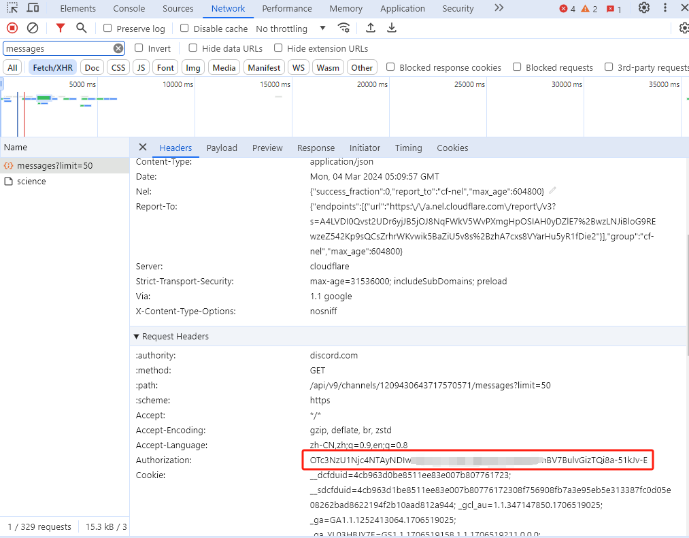

<h1 align="center">Midjourney-Api</h1>
Proxy the Discord channel for MidJourney to enable API-based calls for AI drawing.

English | [中文](./README_zh.md)

## Functions
- [x] Supports Midjourney Imagine instructions
- [x] Supports Midjourney Upscale instructions
- [x] Supports Midjourney Variation instructions
- [x] Supports Midjourney Zoom instructions
- [x] Supports Midjourney Vary instructions
- [x] Supports Midjourney Pan instructions
- [x] Supports Blend (image blending) commands
- [x] Supports Describe (image to text) commands
- [x] Supports translation of Chinese prompts, requires configuration of Baidu Translate or GPT
- [x] Prompt sensitive word pre-detection, supports override adjustment
- [x] User-token connects to WSS (WebSocket Secure), allowing access to error messages and full functionality

## Prerequisite for use
#### 1. Register and subscribe to MidJourney, create your own server and channel，refer to https://docs.midjourney.com/docs/quick-start
#### 2. Obtain user Token, channel ID
- #### Obtain user Token
        Log in to Discord on the web page, press F12 to open the developer tool, refresh the page, find the request for 'messages', and then find the Authorization field in the request body.
    
- #### Obtain channel ID
    ###### Click on the official channel of Midjournal to enter.
    
    ###### Search for 'midjournal' in the upper right corner.  
    
    ###### Click on the midjournal bot to send a private message.
    
    ###### Retrieve the private message channel ID from the URL of the private message.
    
#### 3. Save the token and channelId to the account table in the database.

## Local development
- Depends on Java 17 and Maven.
- Change configuration items: Edit src/main/resources/application.yml
- Project execution: Start the main function of MidjourneyApiApplication.

## Open Api
Provide unofficial MJ open API, which can be used through the following link or added for administrator WeChat consultation. Note: mjapi

Open API usage methods [参考地址](https://blog.csdn.net/voyage_yan/article/details/135335189)

Open API doc [参考地址](https://docs-zh.mjapiapp.com/)

