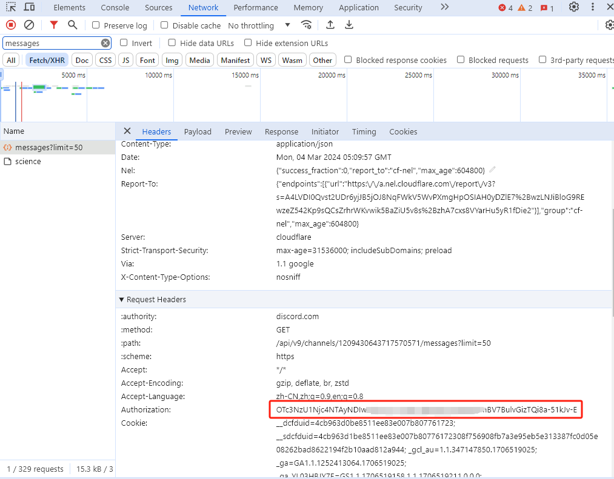
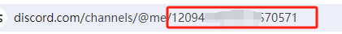

<h1 align="center">Midjourney-Api</h1>
基于代理 MidJourney 的 discord 频道，实现 api 形式AI绘图

中文 | [English](./README.md)

## 功能
- [x] 支持 Midjourney Imgine 指令和相关动作
- [x] 支持 Midjourney Upscale 放大指令
- [x] 支持 Midjourney Variation 变幻指令
- [x] 支持 Midjourney Zoom 扩图指令
- [x] 支持 Midjourney Vary 变化指令
- [x] 支持 Midjourney Pan 平移指令
- [x] 支持 Midjourney Reroll 重新生成
- [x] 支持 Midjourney Blend 图片混合指令
- [x] 支持任务实时进度
- [x] 支持中文prompt翻译，需配置百度翻译或gpt
- [x] prompt 敏感词预检测，支持覆盖调整
- [x] user-token 连接 wss，可以获取错误信息和完整功能
## 使用前提
#### 1. 注册并订阅 MidJourney，创建`自己的服务器和频道`，参考 https://docs.midjourney.com/docs/quick-start
#### 2. 获取用户Token、私信机器人ID：
- #### 获取用户Token
        登录网页端 discord 按F12打开开发者工具，刷新页面，找到 `messages` 的请求 ，然后在请求体中找到authorization字段，他的值就是我们需要的 Token，设置到 mj.discord.user-token。
    
- #### 获取私信机器人ID
    ###### 首先点击midjourney官方频道进入（点击没反应，一般都是梯子问题，梯子换个节点） 。
    
    ###### 右上角搜索midjourney  
    
    ###### 点击midjourney bot,发送私信
    
    ###### 私信的url里取出私信机器人ID，设置到 mj.discord.channel-id。
    

## 本地开发
- 依赖java17和maven
- 更改配置项: 修改src/main/application.yml
- 项目运行: 启动MidjourneyApiApplication的main函数

## 开放API
提供非官方的MJ开放API，可通过以下链接对接使用或添加管理员微信咨询，备注: mjapi

开放API使用方式 [参考地址](https://blog.csdn.net/voyage_yan/article/details/135335189)

开放API文档 [参考地址](https://docs-zh.mjapiapp.com/)

